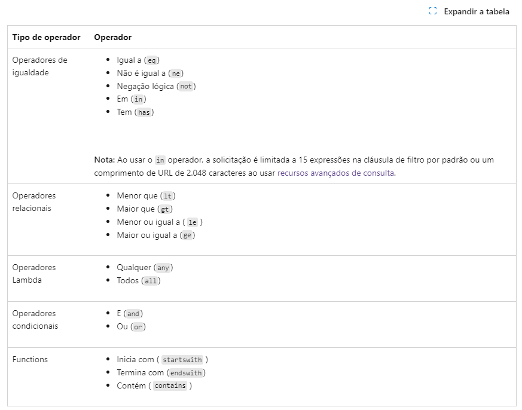

# MS_GRAPH

## Collection to consume API Microsoft Graph

The proposal is to invite users and place them in a B2C application.

All itens in this collection was removed the [Microsoft Graph](`https://learn.microsoft.com/pt-br/graph/overview?context=graph%2Fapi%2F1.0&view=graph-rest-1.0`)

# Strututor

```sh
source/
├── app/
│   ├──data/
│   │   ├── schemas.py
│   ├── images/
│   │   ├── filter_reference.png
│   ├──modules/
│   │   ├── ms_graph.py
│   ├── __init__.py
├── test/
│   ├──tests_ms_graph/
│   │   ├── test_ms_graph.py  # Contém os testes para MSGraph
│   ├── __init__.py
│   ├── conftest.py # Variaveis de Payload e Instancias
│   ├── mocks.py # Mock's responses
├── .env
├── azure_data.json
├── main.py
├── poetry.lock
├── pyproject.toml
├── README.md
```


# Token

### What do you need to do to get your token?

Well, you need to watch this video [YouTube - Graph Microsoft](https://youtu.be/NlrQ6ReYlb4?si=x5ZDk-LHTMLGR-Sq)

1. You will need to create an application in your Azure directory;
2. Create your secret for the application;
3. Get your token_id, client_id and secret_id

## About request Token

With this information, you can make this request. [Get Access](https://learn.microsoft.com/pt-br/graph/auth-v2-service?view=graph-rest-1.0&tabs=http)

```sh
curl --location 'https://login.microsoftonline.com/{{{token_id}}}/oauth2/v2.0/token/' \
--header 'Content-Type: application/x-www-form-urlencoded' \
--header 'Cookie: fpc=AikroW4keohAskOlaTR3wPzC6MHkAQAAAM3J4t0OAAAA; stsservicecookie=estsfd; x-ms-gateway-slice=estsfd' \
--data-urlencode 'client_id={{client_id}}' \
--data-urlencode 'scope=https://graph.microsoft.com/.default' \
--data-urlencode 'client_secret={{secret_id}}' \
--data-urlencode 'grant_type=client_credentials'
```

# Users

### Get User
All requests nedded [Token](#token)

You can get data by user with ID de objeto, you found it in Azure Users.

1. id_user_azure => ID de objeto
   
```sh
curl --location 'https://graph.microsoft.com/v1.0/users/{{id_user_azure}}' \
--header 'Authorization: Bearer  {{token}}'
```

### Get List Users
All requests nedded [Token](#token)

Get all users with this.

```sh
curl --location 'https://graph.microsoft.com/v1.0/users' \
--header 'Authorization: Bearer {{token}}'
```

### Get Users by Filtered
All requests nedded [Token](#token)

For this requests you need user `$filter`, read more about this in [Consulta Filter](https://learn.microsoft.com/pt-br/graph/filter-query-parameter?source=recommendations&tabs=http)

1. $filter => mail eq 'yuri.motoshima@gmail.com'

```sh
curl --location 'https://graph.microsoft.com/v1.0/users?%24filter=mail%20eq%20%27yuri.motoshima%40gmail.com%27' \
--header 'Authorization: Bearer {{token}}'
```



### Update Data User
All requests nedded [Token](#token)

Update data of user.

1. id_user_azure => ID de objeto

```sh
curl --location --request PATCH 'https://graph.microsoft.com/v1.0/users/{{id_user_azure}} \
--header 'Content-Type: application/json' \
--header 'Authorization: Bearer {{token}}' \
--data '
{
  "jobTitle": "Senior Manager"
}'
```

### Create New User
All requests nedded [Token](#token)

This request is only used for new users in your company, if you need to add an existing user in your company call [Invitation](#invitation)

```sh
curl --location 'https://graph.microsoft.com/v1.0/users' \
--header 'Content-Type: application/json' \
--header 'Authorization: Bearer {{token}}' \
--data-raw '{
  "accountEnabled": true,
  "displayName": "Silva, James Moraes",
  "mailNickname": "Silva",
  "userPrincipalName": "james.silva.moraes@accenture.com",
  "passwordProfile" : {
    "forceChangePasswordNextSignIn": true
  }
}'
```

### Delete User
All requests nedded [Token](#token)

Delete user.

1. id_user_azure => ID de objeto

```sh
curl --location --request DELETE 'https://graph.microsoft.com/v1.0/users/{{id_user_azure}}' \
--header 'Authorization: Bearer {{token}}'
```

# Group

Get your company's group information.

```sh
curl --location 'https://graph.microsoft.com/v1.0/groups' \
--header 'Authorization: Bearer {{token}}'
```

# Application

### Get Application
All requests nedded [Token](#token)

Get all application's informations of your company.

```sh
curl --location 'https://graph.microsoft.com/v1.0/applications' \
--header 'Authorization: Bearer {{token}}'
```

### Put User in Application
All requests nedded [Token](#token)

This request is used to insert a new guest into one of your company's applications.

1. principalId => {{id_user_azure}}
2. resourceId => {{id_objeto_empresarial}}
3. appRoleId => {{app_role_id}} [Get this information](#get-application)

```sh
curl --location 'https://graph.microsoft.com/v1.0/servicePrincipals/{{id_objeto_empresarial}}/appRoleAssignments' \
--header 'Content-Type: application/json' \
--header 'Authorization: Bearer {{token}}' \
--data '{
  "principalId": "{{id_user_azure}}",
  "resourceId": "{{id_objeto_empresarial}}",
  "appRoleId": "{{app_role_id}}"
}'
```

### Get Application's Informations 
All requests nedded [Token](#token)

Get application's information by id

1. id_objeto_empresarial => ID de objeto

```sh
curl --location 'https://graph.microsoft.com/v1.0/servicePrincipals/{{id_objeto_empresarial}}' \
--header 'Authorization: Bearer {{token}}'
```

# Service

### Get Services
All requests nedded [Token](#token)

Get all services in your company.

```sh
curl --location 'https://graph.microsoft.com/v1.0/servicePrincipals' \
--header 'Authorization: Bearer {{token}}'
```

# Invitation

### Send Invitation
All requests nedded [Token](#token)

This request is used to invite a new or existing user to your directory.

1. invitedUserEmailAddress => mail the new user
2. inviteRedirectUrl => url your application directory and your tenant
3. sendInvitationMessage => true if do you want sent a message.
4. invitedUserMessageInfo => if sendInvitationMessage is true
   1. customizedMessageBody => your message.


```sh
curl --location 'https://graph.microsoft.com/v1.0/invitations' \
--header 'Content-Type: application/json' \
--header 'Authorization: Bearer {{token}}' \
--data-raw '{
    "invitedUserEmailAddress": "yuri.motoshima@gmail.com",
    "inviteRedirectUrl": "https://myapplications.microsoft.com/?tenantid=353bbcdb-1fd0-49d4-a613-87e4ef96aaec",
    "sendInvitationMessage": true,
    "invitedUserMessageInfo": {
        "customizedMessageBody": "Olá, você foi convidado para acessar nosso diretório."
    }
}'
```
